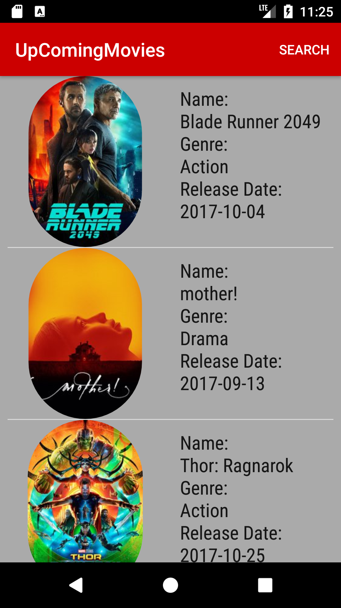

# Upcomingmovies
It is an Android App that shows the list of upcoming movies and gives the user more information about them.

# To run this app
If you have AndroidStudio installed in your machine, you just need to import the UpComingMovies folder
and press the Run button.

- If you had trouble with emulator internet connection(in Windows) you could try to run this code below:
```
{your_android_sdk_folder}\emulator\emulator.exe -avd {name_of_your_emulator} -dns-server 8.8.8.8
```
# Tests
The UIInteraction test is a test created with [espresso](https://developer.android.com/training/testing/ui-testing/espresso-testing.html). You can run the test just right clicking in AndroidStudio Project tab and selecting Run UIInteractionTest.
# Results
There are two views for this application:
The first one showing all the up comming movies:  


The second one when you select one of the movies to see more information:  

